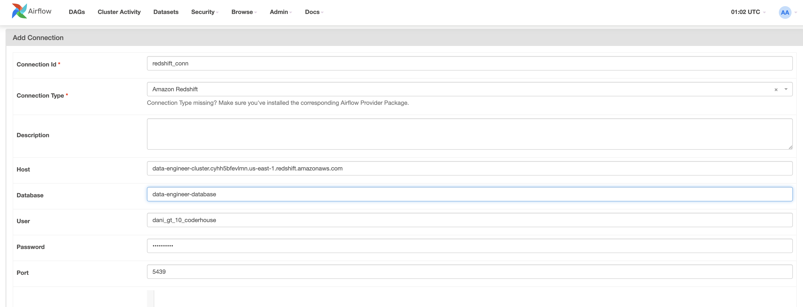
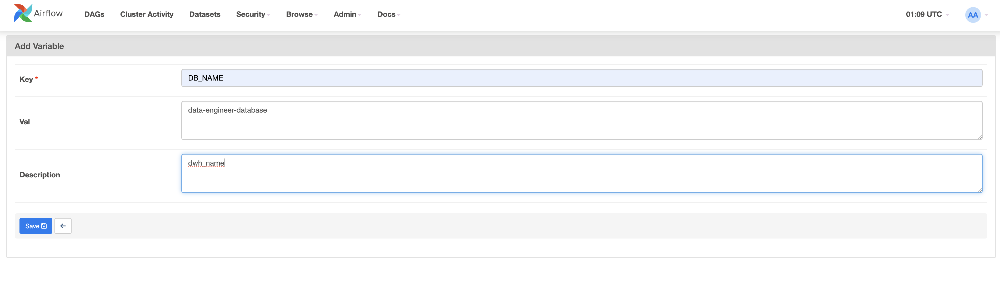

# ETL Crypto Currency

El proyecto "ETL Crypto Currency" tiene como objetivo descargar datos desde la API CoinAPI. Esta API proporciona información sobre las tasas de cambio de criptomonedas en relación con monedas base, lo que permite realizar análisis y seguimiento de los valores de las criptomonedas en diferentes mercados y alertar en caso de un aumento respecto al histórico.

## Estructura del Proyecto

El proyecto está dividido en los siguientes apartados:

- `dags`: Contiene los DAGs necesarios para la ejecución el proceso ETL
    - `sql`: Contiene archivos SQL utilizados en el proyecto.
- `utils`: Contiene un conjunto de funciones que se utilizan para ejecutar el ETL.

## Uso de la API CoinAPI

La API CoinAPI utiliza el siguiente formato de URL base:

https://rest.coinapi.io/v1/exchangerate

Puedes realizar consultas específicas al agregar la denominación de la criptomoneda y la moneda base deseada al final de la URL. Por ejemplo:

- Para consultar la tasa de cambio de Bitcoin (BTC) con respecto al dólar estadounidense (USD):

https://rest.coinapi.io/v1/exchangerate/BTC/USD


- Para obtener tasas de cambio de todas las criptomonedas disponibles en relación con el dólar estadounidense (USD):

https://rest.coinapi.io/v1/exchangerate/USD


La API CoinAPI devuelve datos en formato JSON con los siguientes campos:

- `time`: La fecha y hora en la que se obtuvo la tasa de cambio.
- `asset_id_base`: La criptomoneda de origen.
- `asset_id_quote`: La moneda base con la que se expresa el valor de la criptomoneda.
- `rate`: La tasa de cambio actual.


La API CoinAPI devuelve datos en formato JSON con los siguientes campos:

- `time`: La fecha y hora en la que se obtuvo la tasa de cambio.
- `asset_id_base`: La criptomoneda de origen.
- `asset_id_quote`: La moneda base con la que se expresa el valor de la criptomoneda.
- `rate`: La tasa de cambio actual.

## Mapeo de Datos

Después de realizar una consulta a la API, los datos se mapean utilizando el siguiente convenio:

- `time` -> `created_at`: La fecha y hora en la que se obtuvo la tasa de cambio en formato Timestamp de Redshift.
- `asset_id_base` -> `Moneda`: La criptomoneda de origen.
- `asset_id_quote` -> `Base`: La moneda base con la que se expresa el valor de la criptomoneda.
- `rate` -> `Precio`: La tasa de cambio actual.

## Creación de la Tablas en Amazon Redshift

Se ha creado una tabla staging en Amazon Redshift con la siguiente estructura:

```sql
CREATE TABLE IF NOT EXISTS "data-engineer-database".dani_gt_10_coderhouse.stg_crypto
(
Moneda varchar(30) primary key distkey,
Base varchar(30),
Precio numeric,
created_at timestamp
)
sortkey(created_at); 
```
Esta tabla almacena los resultados dados por coinAPI en el momento de la consulta y se remplaza a cada ejecución

```sql
CREATE TABLE IF NOT EXISTS "data-engineer-database".dani_gt_10_coderhouse.tbl_crypto
(
Moneda varchar(30) primary key distkey,
Base varchar(30),
Precio numeric,
created_at timestamp,
updated_at timestamp,
executed_at timestamp
)
sortkey(created_at,updated_at,executed_at); 
```

## Optimización de Redshift
Se ha utilizado el optimizador de Amazon Redshift llamado **distkey** para la columna Moneda. Esto se hizo con la intención de optimizar la tabla para consultas utilizando el entorno MPP (Procesamiento de Datos en Paralelo Masivo) de Redshift. Cada slice dentro del nodo se divide por tipo de moneda de cripto, lo que permite una mejor optimización para consultas basadas en el tipo de moneda.

También se ha agregado otro **sortkey** en la columna created_at y updated_at, executed_at para organizar la información de cada nodo ordenada por fecha de creación seguido de la fehca de actualización y ejecución. Esto facilita la selección de valores utilizando la fecha como parámetro principal.

## Proceso Creación Tablas con Pandas
Después de la creación de las tablas y la optimización en Amazon Redshift, se utilizó la biblioteca Pandas en Python para insertar valores en la tabla. Este proceso ETL se completó con éxito para cargar y organizar los datos en el Data Warehouse en la base de datos **data-engineer-database** en el schema **dani_gt_10_coderhouse**.

## Documentación del Proceso ETL
Proceso de Carga SCD 1
Se ha implementado un proceso de carga SCD 1 (Slowly Changing Dimension 1) en el proyecto. Esto permite manejar los cambios en los datos y mantener un historial de las modificaciones. El siguiente SQL se utiliza para llevar a cabo este proceso:
```sql
MERGE INTO "data-engineer-database".dani_gt_10_coderhouse.tbl_crypto
USING "data-engineer-database".dani_gt_10_coderhouse.stg_crypto
ON tbl_crypto.Moneda=stg_crypto.Moneda AND tbl_crypto.created_at=stg_crypto.created_at
WHEN MATCHED THEN
    UPDATE SET 
    Precio = stg_crypto.Precio,
    created_at = stg_crypto.created_at,
    updated_at = GETDATE(),
    executed_at = GETDATE()
WHEN NOT MATCHED THEN
    INSERT (Moneda, Base, Precio, created_at, updated_at, executed_at)
    VALUES (stg_crypto.Moneda, stg_crypto.Base, stg_crypto.Precio, stg_crypto.created_at, GETDATE(), GETDATE())
```

Este SQL se utiliza para comparar los datos en la tabla **tbl_crypto** con los datos en la tabla de etapa **stg_crypto**. Si se encuentran la misma fecha de actualización de la consulta a la API created_at, se actualizan los registros existentes y se insertan nuevos registros en **tbl_crypto** con las fechas de modificación apropiadas.

## DAG en Airflow
El proceso ETL fue automatizado implementando un Direct Acyclic Graph en el cual se crean las tablas staging y crypto, posteriormente se cargan usando los datos descargados de coinAPi mediante un script de python que lee y da formato usando un dataframe y posteriormente las compara para realizar el proceso SCD 1 y actualizar los precios de las cryptodivisas al día.


## Iniciar el Proyecto
Para utilizar este proyecto, sigue estos pasos:
1. Clona el repositorio desde [URL del repositorio](https://github.com/VictorVelasc0/Crypto_ETL) o descarga el código fuente en tu máquina.
2. Ejecuta el siguiente comando para iniciar los contenedores de Airflow y ejecutar el Webserver
```
sh start.sh
```
3. Para detener los contenedores ejecute el siguiente comando:
```
sh stop.sh
```

## Iniciar el WebServer de Airflow
Para ingresar a la interfáz gráfica de Airflow ingresa al  [Web UI Airflow](http://localhost:8081/home)

## Antes de comenzar
Antes de comenzar a ejecutar el proceso ETL deberás realizar una serie de configuraciones iniciales, necesarias para que el entorno sea capaz de conectarse a la base de datos posgresql utilizada, sigue los siguientes pasos:

1. Abre el WebServer de airflow [Web UI Airflow](http://localhost:8081/home).


2. Ingresa a Admin -> connections y crea una nueva conexión.


3. Ingresa los el ID de conexión y los datos de connection Id, host, user, database, password y port dados por el administrador del ETL.



4. Ingresa a Admin -> Variables y agrega la información de las siguientes varibles:
    - `DB_HOST`: Hostname de Refshift configurado anteriormente
    - `DB_USER`: User de Refshift configurado anteriormente
    - `DB_NAME`: Data base name de Refshift configurado anteriormente
    - `DB_PORT`: Puerto de Redshift
    - `DB_PASSWORD`: Contraseña de Redshift dada por el administrador del Data Warehouse
    - `DWH_SCHEMA`: Esquema donde se tiene permisos de lectura y escritura para ejecutar el proceso ETL
    - `API_KEY`: Clave API de coinAPI para la extracción de datos crypto



5. Asegurarse de tener configuradas todas las variables necesarias para ejecutar el DAG.


## Contribuciones
Las contribuciones a este proyecto son bienvenidas. Si deseas contribuir, asegúrate de crear un "fork" del repositorio y abrir una solicitud de extracción con tus cambios.

## Licencia
Este proyecto está licenciado bajo la Licencia MIT. Consulta el archivo LICENSE para obtener más información.


